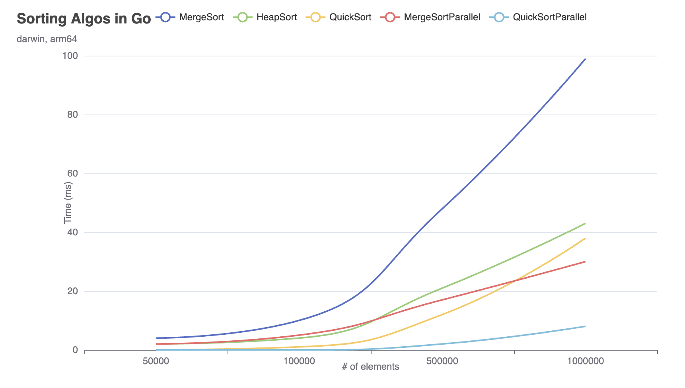
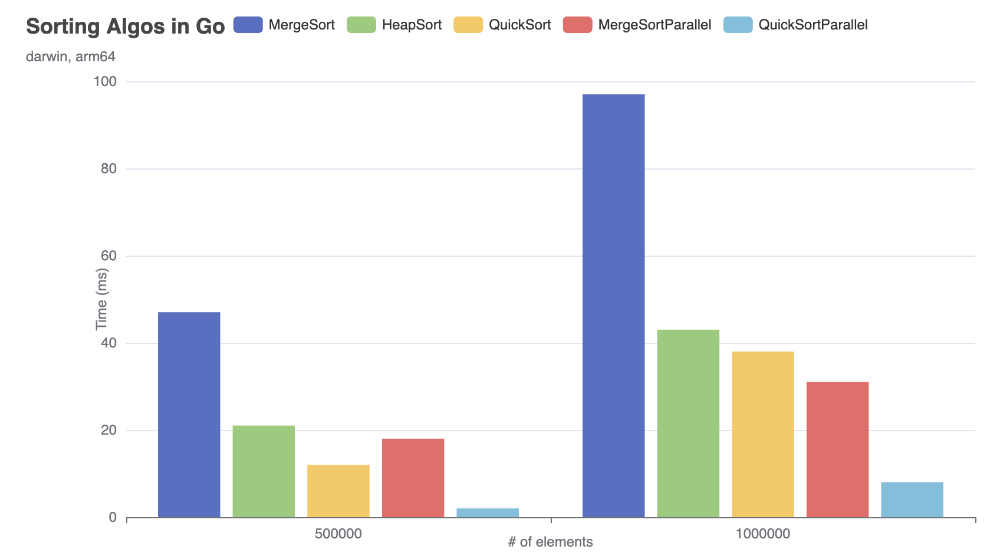

# benchviz

This module provides a visualization tool for Go benchmark results.

## Purpose

The purpose of `benchviz` is to help developers analyze and visualize the performance of their Go code by providing a user-friendly interface for benchmark results. It aims to simplify the process of interpreting benchmark data and identifying performance bottlenecks.

## Download

To download `benchviz`, follow these steps:

1. Install the module by running `go get github.com/pranish-pantha/benchviz`.
2. Import the module in your Go code: `import "github.com/pranish-pantha/benchviz"`.

## License

This project is licensed under the [MIT License](https://opensource.org/licenses/MIT).

## Examples

This module includes a complete example of how to use `benchviz` to visualize popular sorting algorithm benchmarks.

